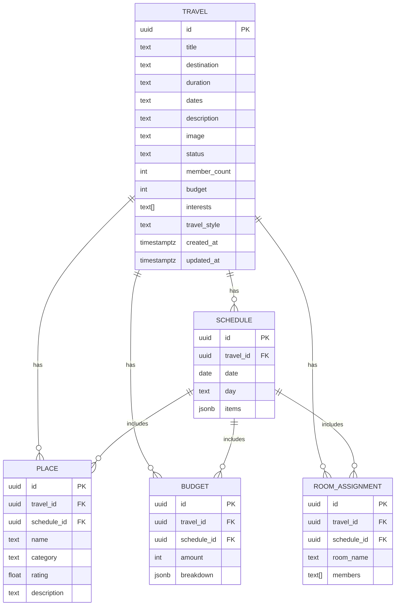

# 旅行アプリ（Supabase/Postgres版）

React + Supabase + Postgresで構築された旅行管理アプリケーションです。

## 技術スタック

- **フロントエンド**: React + TypeScript + Vite
- **バックエンド**: Supabase（Postgres + Auth + Edge Functions）
- **UI**: Tailwind CSS
- **認証**: Supabase Auth
- **データベース**: PostgreSQL（Supabase）

## 機能

### 認証機能
- ユーザー登録・ログイン・ログアウト
- セッション管理

### 旅行管理
- 旅行の作成・編集・削除
- スケジュール管理
- 観光スポット管理
- 予算管理
- 部屋割り管理

### データ関連付け
- 旅行とスケジュールの関連付け
- スケジュールと観光スポットの関連付け
- スケジュールと予算の関連付け
- スケジュールと部屋割りの関連付け

## セットアップ

### 1. 依存関係のインストール

```bash
npm install
```

### 2. 環境変数の設定

`.env`ファイルを作成し、以下の環境変数を設定：

```env
# Supabase設定
VITE_SUPABASE_URL=your_supabase_url_here
VITE_SUPABASE_ANON_KEY=your_supabase_anon_key_here

# Google AI API（オプション）
GOOGLE_AI_API_KEY=your_google_ai_api_key_here
```

### 3. Supabaseプロジェクトの設定

1. [Supabase](https://supabase.com)でプロジェクトを作成
2. プロジェクトのURLとAnon Keyを環境変数に設定
3. SQL Editorで以下のマイグレーションを実行：

```sql
-- Travel（旅行）
create table if not exists travel (
  id uuid primary key default gen_random_uuid(),
  title text not null,
  destination text not null,
  duration text not null,
  dates text not null,
  description text,
  image text,
  status text not null default 'planning',
  member_count integer not null,
  budget integer not null,
  interests text[],
  travel_style text,
  created_at timestamptz not null default now(),
  updated_at timestamptz not null default now()
);

-- Schedule（スケジュール）
create table if not exists schedule (
  id uuid primary key default gen_random_uuid(),
  travel_id uuid references travel(id) on delete cascade,
  date date not null,
  day text,
  items jsonb,
  created_at timestamptz not null default now(),
  updated_at timestamptz not null default now()
);

-- Place（観光スポット）
create table if not exists place (
  id uuid primary key default gen_random_uuid(),
  travel_id uuid references travel(id) on delete cascade,
  schedule_id uuid references schedule(id) on delete set null,
  name text not null,
  category text,
  rating float,
  description text,
  created_at timestamptz not null default now(),
  updated_at timestamptz not null default now()
);

-- Budget（予算）
create table if not exists budget (
  id uuid primary key default gen_random_uuid(),
  travel_id uuid references travel(id) on delete cascade,
  schedule_id uuid references schedule(id) on delete set null,
  amount integer not null,
  breakdown jsonb,
  created_at timestamptz not null default now(),
  updated_at timestamptz not null default now()
);

-- RoomAssignment（部屋割り）
create table if not exists room_assignment (
  id uuid primary key default gen_random_uuid(),
  travel_id uuid references travel(id) on delete cascade,
  schedule_id uuid references schedule(id) on delete set null,
  room_name text not null,
  members text[],
  created_at timestamptz not null default now(),
  updated_at timestamptz not null default now()
);
```

### 4. 開発サーバーの起動

```bash
npm run dev
```

## データベース設計

### ER図



## API

### SupabaseクライアントAPI

- `travelApi` - 旅行のCRUD操作
- `scheduleApi` - スケジュールのCRUD操作
- `placeApi` - 観光スポットのCRUD操作
- `budgetApi` - 予算のCRUD操作
- `roomAssignmentApi` - 部屋割りのCRUD操作

### Edge Functions

- `travel-api` - 旅行管理API（認証付き）

## 移行履歴

### MongoDB → Supabase/Postgres

- **MongoDB依存部分を削除**：
  - `backend/` ディレクトリ（Express/Node.js）
  - Mongooseモデル
  - MongoDB接続設定

- **Supabase機能を活用**：
  - PostgreSQLデータベース
  - Supabase Auth（認証）
  - Edge Functions（API）
  - Supabase Studio（管理画面）

## 開発

### コマンド

```bash
# 開発サーバー起動
npm run dev

# ビルド
npm run build

# プレビュー
npm run preview

# リント
npm run lint
```

### ファイル構造

```
src/
├── components/
│   ├── Auth.tsx          # 認証コンポーネント
│   ├── Header.tsx        # ヘッダー
│   └── ...
├── services/
│   ├── supabase.ts       # Supabaseクライアント
│   └── travelApi.ts      # API呼び出し
└── ...
```

## ライセンス

MIT
